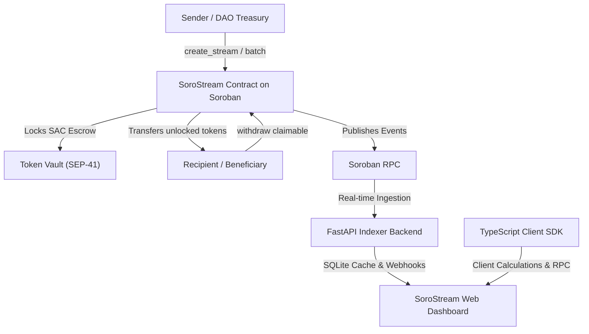

# SoroStream 🌊

> **Trustless, per-second linear asset streaming and cliff vesting protocol for Soroban Asset Contracts (SAC) on the Stellar Network.**

[](https://github.com/HassanKorey/SoroStream/actions)
[](LICENSE)
[](https://soroban.stellar.org)
[](https://fastapi.tiangolo.com)
[](sdk/)

---

## 🌟 Overview

**SoroStream** is a native, trustless asset streaming and vesting escrow protocol built on **Stellar** smart contracts (Soroban). It enables DAOs, corporate treasuries, Web3 founders, and grant allocators to lock tokens (XLM, USDC, or custom SEP-41 Soroban Asset Contracts) and stream them continuously to recipients second-by-second over customizable schedules with optional cliff milestones and revocation controls.

### Key Highlights
- **Sub-Second Precision**: Tokens unlock linearly every ledger second with zero gas state updates required.
- **Cliff Vesting Protection**: Guarantee lockups until cliff milestones are reached.
- **Atomic Batch Creation**: Onboard entire rosters or DAO distributions in a single transaction.
- **BUX-Inspired Glassmorphic UI**: High-contrast dark canvas (`#090D16`), vibrant emerald accents (`#10B981`), Bento Grid metric layouts, and live per-second tickers.
- **Multi-Token Verification**: Native support for Soroban Asset Contracts conforming to SEP-41.
- **Security-First**: Formally verified against cliff bypass, double-withdraw race conditions, and unauthorized cancellations.

---

## 📐 Protocol Architecture



---

## ⚡ Mathematical Specification

The smart contract calculates unlocked tokens dynamically on invocation without needing periodic cron jobs or per-second storage writes. Let $t$ be the current ledger timestamp (`env.ledger().timestamp()`):

$$\text{Unlocked}(t) = \begin{cases} 
0 & \text{if } t < t_{\text{cliff}} \\
A_{\text{total}} & \text{if } t \ge t_{\text{end}} \\
\left\lfloor \frac{A_{\text{total}} \times (t - t_{\text{start}})}{t_{\text{end}} - t_{\text{start}}} \right\rfloor & \text{otherwise}
\end{cases}$$

$$\text{Claimable}(t) = \text{Unlocked}(t) - A_{\text{claimed}}$$

---

## 📂 Repository Structure

```
SoroStream/
├── .github/workflows/ci.yml       # Automated quality gates (Rust, Python, Node)
├── contracts/vesting_stream/      # Core Soroban Rust smart contracts
│   ├── src/lib.rs                 # Contract logic, DataKeys, linear math
│   └── src/test.rs                # Comprehensive Rust unit test suite
├── backend/                       # FastAPI RPC indexer and webhook service
│   ├── app/main.py                # REST endpoints, OpenAPI schemas
│   ├── app/models.py              # Pydantic models & SQLite storage
│   ├── app/soroban_client.py      # Soroban RPC client and event listener
│   ├── app/webhook_worker.py      # Background webhook dispatcher
│   └── tests/                     # Security vectors & API test suite
├── sdk/                           # Official TypeScript SDK (@sorostream/sdk)
│   ├── src/client.ts              # Contract RPC wrapper
│   ├── src/math.ts                # Pure TypeScript vesting calculations
│   └── src/types.ts               # Shared interfaces and types
├── frontend/                      # BUX-inspired Next.js Web3 dashboard
│   ├── src/components/            # Bento grid, visualizer, live ticker
│   ├── src/pages/                 # Dashboard, stream details, create wizard
│   └── src/styles/                # Glassmorphic Tailwind theme
├── scripts/
│   └── deploy_testnet.sh          # Automated testnet deploy & Friendbot funding
├── CONTRIBUTING.md
├── MAINTAINERS.md
├── SECURITY.md
└── README.md
```

---

## 🚀 Quick Start Guide

### 1. Smart Contracts (Rust)
```bash
cd contracts/vesting_stream
cargo test
cargo clippy --all-targets -- -D warnings
```

### 2. Backend Indexer (Python)
```bash
cd backend
python3 -m venv venv
source venv/bin/activate
pip install -r requirements.txt
uvicorn app.main:app --reload --port 8000
```
Interactive API documentation: `http://localhost:8000/docs`

### 3. TypeScript SDK
```bash
cd sdk
npm install
npm run build
npm test
```

### 4. Testnet Deployment
Deploy to Stellar Testnet and auto-fund via Friendbot:
```bash
./scripts/deploy_testnet.sh
```

---

## 📄 License

MIT License. See [LICENSE](LICENSE) for details.
